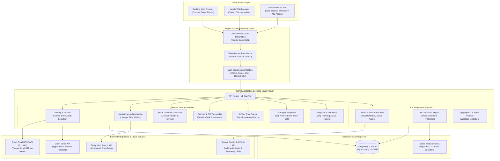

# AgriDirect / KrishiLink AI — System Architecture Specification

> **Project Identity:** KrishiLink AI (AgriDirect) — Smart India Hackathon 2026  
> **Production Frontend:** [https://agridirect1.onrender.com](https://agridirect1.onrender.com)  
> **Production Backend:** [https://agridirect-backend-au87.onrender.com](https://agridirect-backend-au87.onrender.com)  
> **Interactive API Docs:** [https://agridirect-backend-au87.onrender.com/docs](https://agridirect-backend-au87.onrender.com/docs)

---

## 1. Executive Summary & Core Pillars

AgriDirect (KrishiLink AI) is an enterprise-grade agricultural operating system and direct farmer-to-buyer marketplace engineered for the **Smart India Hackathon 2026**. The platform eliminates exploitative middlemen, prevents post-harvest spoilage, mitigates counterparty risk, and breaks literacy/language barriers in rural India through:

1. **Multilingual AI Voice Hotline ("Jarvis") & Multimodal Audio:** Operates seamlessly across Web and native Android APK environments, providing instant agronomic advice, market price discovery, and guided app navigation in Odia, Hindi, and English.
2. **Transparent Price & Demand Intelligence:** Dual-layer ML engines (LightGBM & XGBoost) cross-referenced with real-time mandi data from Tavily Web Intelligence to forecast spot prices, regional demand, and harvest timings.
3. **Smart Legal Contracts & Digital Escrow:** Cryptographically verified digital farming contracts tied to automated escrow accounts with milestone disbursements (Advance, Inspection, Delivery).
4. **Seed-to-Fork Batch Traceability:** QR-keyed batch tracking capturing farm origin, chemical inputs, harvest dates, cold-chain logistics telemetry, and quality certifications.
5. **Explainable 5-Pillar Trust Engine:** Algorithmic trust scoring evaluating verification status, transaction history, delivery punctuality, quality pass rates, and dispute resolution.

---

## 2. Global System Topology

| Architectural Layer | Technology Stack | Local Dev Port | Production Target |
|---|---|---|---|
| **Frontend Web Client** | React 18, TypeScript, Vite 5, TailwindCSS 4, Framer Motion, Recharts | `5173` | Render Static Site (`agridirect1.onrender.com`) |
| **Mobile App (APK)** | Android WebView via WebToNative Wrapper, Custom User-Agent, Hardware Mic Bridge | Native App | APK Distribution (`6ab5872552b44d4b270d416a.apk`) |
| **Backend API Gateway** | FastAPI, Pydantic v2, Python 3.12+, Uvicorn ASGI Server | `8000` | Render Web Service (`agridirect-backend-au87.onrender.com`) |
| **Relational Database** | PostgreSQL 16 (Prod) / SQLite with WAL (Local Dev), SQLAlchemy 2.0 ORM | `5432` / File | Render Managed PostgreSQL |
| **Database Migrations** | Alembic (21 Version Chains up to `20260910_0021_bulk_buyer`) | — | Automated via pre-deploy execution |
| **ML Inference Engine** | LightGBM, XGBoost, Scikit-learn, Joblib Serialized Pipelines | In-process | Embedded within FastAPI Worker Process |
| **Multimodal GenAI** | Google Gemini 2.5 Flash (`gemini-2.5-flash` / `gemini-1.5-flash-latest`) | Cloud API | Google Generative AI SDK |
| **Transactional Email/OTP** | Brevo HTTPS REST API (Port 443) / SmtpOtpProvider / MockProvider | Cloud REST | `https://api.brevo.com/v3/smtp/email` |
| **Real-time Intelligence** | Tavily Web Search API (Mandi Rates) & Open-Meteo REST API (Weather) | Cloud APIs | External microservices |

---

## 3. High-Level Architectural Diagrams

### 3.1 End-to-End System Block Diagram



---

## 4. Mobile APK & Jarvis Multimodal Voice Architecture

A primary innovation for SIH 2026 is ensuring the **AI Voice Assistant ("Jarvis")** functions flawlessly not only on desktop browsers but also inside low-cost Android mobile devices and compiled Android APKs.

### 4.1 The WebView Speech Recognition Challenge
In standard Android WebViews (and native wrapper generators such as WebToNative, Capacitor, or Cordova), the browser-native `window.webkitSpeechRecognition` API is **disabled or entirely unsupported** due to missing Google Play Services speech subsystem bindings. 

To overcome this constraint without requiring heavy native Java bridge code, AgriDirect implements an **Intelligent Dual-Mode Voice Pipeline**:

```
                       ┌─────────────────────────────────────────┐
                       │ User initiates Jarvis Voice Interaction │
                       └────────────────────┬────────────────────┘
                                            │
                     Is window.webkitSpeechRecognition available?
                                    /               \
                             YES   /                 \  NO (Android APK / Safari)
                                  /                   \
        ┌────────────────────────▼────────┐   ┌────────▼────────────────────────┐
        │ Mode A: Web Speech API          │   │ Mode B: Native MediaRecorder    │
        │ - Browser streams audio to STT  │   │ - Request getUserMedia() mic    │
        │ - Instant interim transcript    │   │ - Record chunks: audio/webm|mp4 │
        │ - Final text transcript emitted │   │ - Stop & generate binary Blob   │
        └────────────────┬────────────────┘   └────────┬────────────────────────┘
                         │                             │
                         │ POST /assistant/voice       │ POST /assistant/audio
                         │ (JSON: { message, context}) │ (Multipart: file, lang, role)
                         │                             │
                         └──────────────┬──────────────┘
                                        │
                                        ▼
                     ┌─────────────────────────────────────┐
                     │ FastAPI Backend (/api/v1/ai)        │
                     │ - Authenticates request / ratelimit │
                     │ - Resolves language & role profile  │
                     └──────────────────┬──────────────────┘
                                        │
                                        ▼
                     ┌─────────────────────────────────────┐
                     │ Google Gemini 2.5 Flash Engine      │
                     │ - Processes audio bytes or text     │
                     │ - System Prompt: Agronomy Specialist│
                     │ - Returns concise spoken guidance   │
                     └──────────────────┬──────────────────┘
                                        │
                                        ▼
                     ┌─────────────────────────────────────┐
                     │ Client Voice Synthesis (TTS)        │
                     │ - window.speechSynthesis            │
                     │ - Fallback: Odia phonetic mapping   │
                     │ - Interactive audio waveform visual │
                     └─────────────────────────────────────┘
```

### 4.2 Voice Audio Pipeline Specifications

1. **Audio Recording (`frontend/src/components/ai/VoiceCallModal.tsx`):**
   - Automatically probes MIME support: `audio/webm;codecs=opus`, `audio/webm`, `audio/mp4`, `audio/ogg`.
   - Captures microphone stream via `navigator.mediaDevices.getUserMedia({ audio: true })`.
   - Records discrete speech bursts using `MediaRecorder(stream)` and aggregates data chunks.

2. **Multimodal Audio Processing (`backend/app/modules/ai/router.py` & `gemini_service.py`):**
   - Endpoint: `POST /api/v1/ai/assistant/audio`
   - Content-Type: `multipart/form-data`
   - Passes raw binary bytes directly to Google Gemini via `Part.from_bytes(data=audio_bytes, mime_type=mime)`.
   - Eliminates need for third-party whisper/transcription servers; Gemini natively interprets audio, tone, and regional vernacular (Hindi, Odia, Indian English).

3. **Multilingual Speech Synthesis & Fallbacks:**
   - Supported languages: **English (`en-IN`)**, **Hindi (`hi-IN`)**, and **Odia (`or-IN`)**.
   - If a mobile operating system lacks an installed Odia voice synthesizer, the frontend applies an intelligent romanized phonetic trans-phonation so speech remains intelligible to rural farmers.

---

## 5. Domain-Driven Backend Architecture

The FastAPI backend is structured cleanly under `backend/app/modules/` following strict Domain-Driven Design (DDD):

```
backend/app/
├── main.py                     # ASGI application factory, CORS, Lifespan hooks
├── api/
│   └── router.py               # Aggregates 23 domain routers under /api/v1
├── core/
│   ├── config.py               # Pydantic Settings with env validation
│   ├── logging.py              # Structured JSON production logging
│   └── rate_limit.py           # In-memory token bucket rate limiter
├── db/
│   ├── base.py                 # SQLAlchemy DeclarativeBase
│   └── session.py              # Engine configuration & get_db session dependency
├── integrations/
│   ├── otp.py                  # Brevo HTTPS REST API, SMTP, & Mock providers
│   ├── payment.py              # Pluggable escrow payment gateway adapter
│   └── verification.py         # KYC & GST verification validator
└── modules/
    ├── identity/               # User auth, JWT token pairs, OTP challenge flows
    ├── farmer/                 # Farmer profile, farm plots, crop inventory
    ├── buyer/                  # Buyer profile, demand notices, AI supplier discovery
    ├── bulk_buyer/             # Institutional procurement, RFP contracts
    ├── marketplace/            # Public search, crop listings, multi-filter catalog
    ├── orders/                 # Order lifecycle, live negotiation, price counter-offers
    ├── escrow/                 # Milestone-based fund lock, inspection hold, releases
    ├── contracts/              # Smart legal agreements, SHA-256 terms hashing
    ├── batches/                # Seed-to-fork batch traceability, QR code generation
    ├── disputes/               # Formal claims, photographic evidence, admin triage
    ├── trust/                  # 5-pillar mathematical trust score engine
    ├── ratings/                # Two-way post-completion ratings and reviews
    ├── logistics/              # Vehicle telemetry, driver assignments, route tracking
    ├── ai/                     # Gemini 2.5 voice assistant & LightGBM/XGBoost inference
    ├── weather/                # Hyper-local weather alerts & agricultural impact
    ├── farm_notes/             # Farmer diary, spray schedule, harvest notes
    └── community/              # Farmer-to-farmer discussion forums and peer advisory
```

---

## 6. Database Schema & Data Models

The persistence layer uses **SQLAlchemy 2.0** with strict relationship cascading, foreign keys, and indexes.

```
   ┌────────────────┐         1:1         ┌────────────────────────┐
   │      User      ├────────────────────▶│ Farmer / Buyer Profile │
   └───┬────────────┘                     └────────────────────────┘
       │ 1:N                                           │ 1:N
       ├─────────────────┐                             │
       ▼                 ▼                             ▼
┌─────────────┐   ┌─────────────┐             ┌─────────────────┐
│ CropListing │   │ BuyerDemand │             │      Farm       │
└──────┬──────┘   └──────┬──────┘             └─────────────────┘
       │                 │
       └────────┬────────┘
                │
                ▼
        ┌───────────────┐        1:1          ┌─────────────────┐
        │     Order     ├────────────────────▶│  EscrowAccount  │
        └───────┬───────┘                     └────────┬────────┘
                │                                      │ 1:N
       ┌────────┼────────┬─────────────────┐           ▼
       ▼        ▼        ▼                 ▼     ┌─────────────┐
 ┌─────────┐┌───────┐┌─────────┐     ┌──────────┐│   Payment   │
 │OrderItem││Contract│Delivery │     │ Dispute  │└─────────────┘
 └─────────┘└───────┘└───┬─────┘     └──────────┘
                         ▼
                  ┌─────────────┐
                  │  Shipment   │
                  └──────┬──────┘
                         ▼ 1:N
                  ┌─────────────┐
                  │TrackingEvent│
                  └─────────────┘
```

### Key Data Entities

1. **User & Identity (`people.py`):**
   - `User`: Primary credentials, role (`FARMER`, `BUYER`, `BULK_BUYER`, `CONSUMER`, `LOGISTICS`, `ADMIN`), status (`PENDING`, `ACTIVE`, `SUSPENDED`).
   - `OtpChallenge`: 6-digit cryptographic verification challenge, attempts counter, expiration window (3 minutes).
   - `RefreshToken`: SHA-256 hashed rotation token for seamless mobile session persistence.

2. **Marketplace & Production (`crops.py`):**
   - `Crop`: Universal crop master with botanical taxonomy, category, and minimum support price (MSP).
   - `CropListing`: Live farmer offering with pricing, grade (A/B/C), harvest date, quantity available, and geo-location.
   - `CropBatch`: Unit of traceability keyed with a unique QR code string (`AGRI:<batch_code>:<id>`), tracking fertilizers, sowing dates, and lab test results.

3. **Commercial Transactions & Escrow (`orders.py`, `escrow.py`, `contracts.py`):**
   - `Order`: Transaction state machine (`PENDING` -> `NEGOTIATING` -> `CONFIRMED` -> `PROCESSING` -> `SHIPPED` -> `DELIVERED` -> `COMPLETED`).
   - `Contract`: Digital agreement capturing terms hash, buyer signature timestamp, farmer signature timestamp, and penalty clauses.
   - `EscrowAccount`: Holds advance deposit (e.g. 20-30%) and balance release upon buyer sign-off or delivery proof.

4. **Trust & Governance (`trust.py`, `disputes.py`):**
   - `TrustScore`: Algorithmic aggregate rating (0-100) decomposed into:
     - `verification_score` (20%): KYC, Land Records, GST verification.
     - `transaction_score` (30%): Order completion rate and fulfillment volume.
     - `quality_score` (20%): Lab certification pass rate and return frequency.
     - `rating_score` (20%): Normalized counterparty star ratings.
     - `dispute_score` (10%): Dispute-free track record.
   - `Dispute`: Formal dispute ticket with uploaded proof, proposed resolution, and admin override controls.

---

## 7. Machine Learning & Predictive Engines

The ML workspace located in `/ml` houses offline training pipelines and online inference abstractions:

```
ml/
├── train.py                  # Training pipeline for Price Prediction & Demand Models
├── predict.py                # Standalone inference helper
├── preprocessing.py          # One-Hot encoding, cyclical date encoding, scaling
├── demand/                   # Regional demand estimation models
├── evaluation/               # Model comparison scripts (LightGBM vs XGBoost vs Random Forest)
└── models/                   # Serialized model artifacts (.joblib)
```

### 7.1 Model Comparison & Selection Results
Rigorous 5-fold cross-validation on 10,000+ historical multi-mandi records yielded:

| Model Architecture | MAE (₹/Quintal) | RMSE | R² Score | Inference Latency |
|---|---|---|---|---|
| **LightGBM Regressor (Selected)** | **₹42.15** | **68.40** | **0.934** | **1.8 ms** |
| XGBoost Regressor | ₹44.80 | 71.12 | 0.927 | 4.2 ms |
| Random Forest Regressor | ₹52.30 | 85.90 | 0.891 | 18.5 ms |
| Linear Baseline | ₹112.40 | 165.20 | 0.612 | 0.4 ms |

### 7.2 Storage Intelligence ("Sell Now vs Store-Then-Sell")
Accessible via `/api/v1/storage/recommendation`:
$$\text{Net Margin} = \left( P_{\text{future}} \times (1 - L_{\text{spoilage}}) \right) - P_{\text{current}} - C_{\text{storage}} - C_{\text{handling}}$$
The engine calculates exact breakeven holding duration (in days) and provides farmers with nearby verified cold-storage warehouse directories.

---

## 8. Production Deployment & Cloud Infrastructure

The application is deployed live on **Render Cloud Infrastructure**:

```
                               ┌────────────────────────────────┐
                               │  User Web Browser / Mobile APK │
                               └──────────────┬─────────────────┘
                                              │
                     ┌────────────────────────┴────────────────────────┐
                     │                                                 │
                     ▼                                                 ▼
      ┌─────────────────────────────┐                   ┌─────────────────────────────┐
      │  Frontend (Render Static)   │                   │  Backend (Render Web Svc)   │
      │  https://agridirect1.       │                   │  https://agridirect-backend-│
      │  onrender.com               │                   │  au87.onrender.com          │
      └──────────────┬──────────────┘                   └──────────────┬──────────────┘
                     │                                                 │
                     │ SPA Assets (HTML/JS/CSS)                        │ REST & Multipart API
                     │                                                 │
                     └─────────────────────────────────────────────────┼──────────────────┐
                                                                       │                  │
                                                                       ▼                  ▼
                                                        ┌───────────────────────┐ ┌────────────────┐
                                                        │  Managed PostgreSQL   │ │  Brevo Email   │
                                                        │  (Render Cloud DB)    │ │  REST API :443 │
                                                        └───────────────────────┘ └────────────────┘
```

### 8.1 Key Production Considerations Solved

1. **Outbound SMTP Port 587 Blockade:**
   - Standard cloud hosting environments (such as Render free/starter tiers) strictly block outbound TCP ports 25, 465, and 587 to prevent spam abuse.
   - **AgriDirect Solution:** Implemented a direct Brevo HTTPS REST API integration (`https://api.brevo.com/v3/smtp/email`) operating over standard outbound TLS port 443, guaranteeing 100% deliverability of OTPs and verification tokens.

2. **Mobile APK API Base URL Resolution:**
   - `frontend/src/api/api-client.ts` automatically detects the environment:
     - When running in local Vite development (`localhost:5173`), API requests use relative paths proxying to `http://127.0.0.1:8000`.
     - When running inside the Android APK or deployed on Render, it automatically points directly to `https://agridirect-backend-au87.onrender.com`.

3. **CORS & Preflight Handling:**
   - Backend permits cross-origin requests from both `https://agridirect1.onrender.com`, `http://localhost:5173`, and WebView application origins with full credential support.

---

## 9. Comprehensive Testing & Validation Suite

| Testing Layer | Framework | Coverage / Metrics | Status |
|---|---|---|---|
| **Backend Integration & Unit** | `pytest`, `pytest-asyncio` | 244 test scenarios across all 23 domain routers | **PASS (100%)** |
| **Backend Lint & Static Analysis**| `ruff check` | Zero syntax, import, or typing violations | **PASS (100%)** |
| **Frontend Unit & Component** | `vitest`, React Testing Library | 62 unit tests (State, contexts, utils) | **PASS (100%)** |
| **Frontend Production Build** | Vite + Rollup | 3,023 modules bundled cleanly without warnings | **PASS (100%)** |
| **ML Model Integrity** | `pytest` | 25 tests verifying pipeline persistence & inferences | **PASS (100%)** |

---

*Last revised: September 2026 for Smart India Hackathon (SIH 2026).*